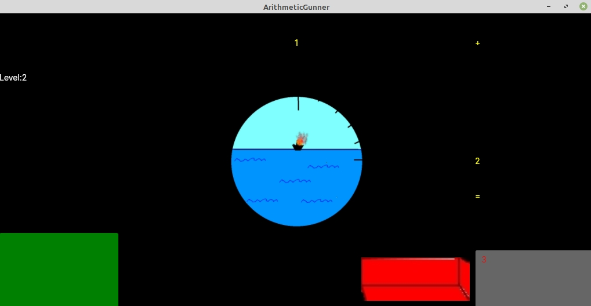
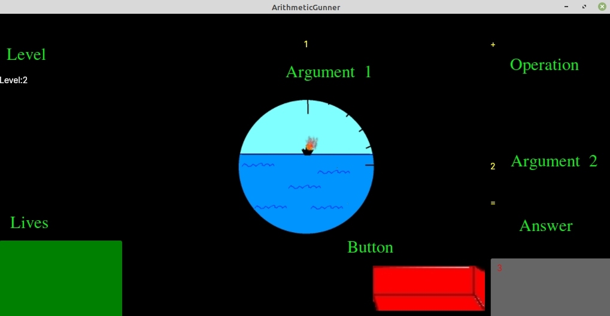

# ArithmeticGunner

I am trying to study WPF like UI framework Avalonia.
ArithmeticGunner is game for kids to train the multiplication table and other arithmetic opertions.

Screenshot:

Screenshot with comments:

